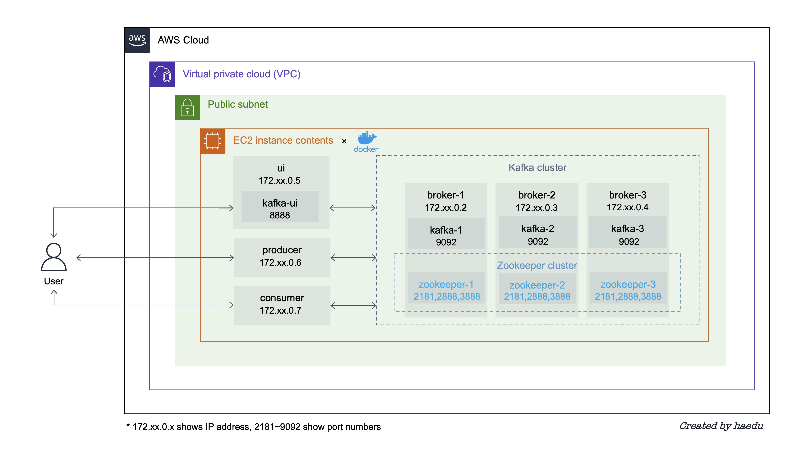

# EC2 の Docker 上に Apache Kafka cluster を構築する方法

- [EC2 の Docker 上に Apache Kafka cluster を構築する方法](#EC2-の-Docker-上に-Apache-Kafka-clusterを構築する方法)
  - [概要](#概要)
  - [準備](#準備)
    - [EC2 インスタンスの起動と接続](#EC2-インスタンスの起動と接続)
    - [Docker のインストール](#Docker-のインストール)
    - [docker-compose のインストール](#docker-compose-のインストール)
    - [sudo なしで docker コマンドの実行するための設定](#sudo-なしで-docker-コマンドの実行するための設定)
    - [GitHub の clone](#GitHub-の-clone)
    - [コンテナの作成と Kafka の初期設定](#コンテナの作成と-Kafka-の初期設定)
  - [Kafka cluster の作成の概要](#kafka-cluster-の作成の概要)
    - [Zookeeper cluster の作成](#zookeeper-cluster-の作成)
    - [Kafak cluster の作成](#kafka-cluster-の作成)
  - [Kafka UI の起動](#Kafka-UI-の起動)
    - [Kafka UI](#kafka-ui)
  - [Client の作成の概要](#Client-の作成の概要)
    - [Producer の作成](#producer-の作成)
    - [Consumer の作成](#consumer-の作成)
  - [Kafka cluster と client の動作確認](#Kafka-cluster-と-client-の動作確認)
  - [Clean up](#Clean-up)

## 概要
---



EC2 で Docker を立ち上げ、上記の構成で下記を構築します。

- Kafka cluster (Broker × 3, Zookeeper × 3)
- Kafka client (Producer × 1, Consumer × 1)
- Kafka UI

検証した環境は以下です。

- AMI: Amazon Linux 2023
  - インスタンスタイプ: t2.xlarge
  - ボリュームサイズ: 20 (GiB)
- Docker: 20.10.25
- Docker Compose: v2.4.1

※ 以降の作業は複数のターミナルでの作業をおすすめします（3 つの Broker、1 つの Kafka ui、Producer、および Consumer 用に 6 つのターミナルを立ち上げておくと楽でした）

## 準備

### EC2 インスタンスの起動と接続

【手順】
1. マネージメントコンソール画面から EC2 インスタンスを起動
（Kafka cluster を構築するため、大きめのインスタンスタイプとストレージがおすすめ）
```EC2 の環境
AMI: Amazon Linux 2023
インスタンスタイプ: t2.xlarge
ボリュームサイズ: 20 (GiB)
```
2. EC2 インスタンスの SSH 接続
```shell
chmod 400 <your key>.pem
ssh -i "<your key>.pem" ec2-user@<your ec2 ip>.ap-northeast-1.compute.amazonaws.com
```
3. EC2 のパッケージの更新
```shell
sudo yum update -y
```

### Docker のインストール

【手順】
1. Docker のインストール
```shell
sudo yum install -y docker
```
2. バージョンの確認
```shell
docker --version
>>> Docker version 20.10.25, build b82b9f3
```

### docker-compose のインストール

【手順】
1. ディレクトリの作成
```shell
sudo mkdir -p /usr/local/lib/docker/cli-plugins
```
2. ファイルのダウンロード
```shell
VER=2.4.1
sudo curl -L https://github.com/docker/compose/releases/download/v${VER}/docker-compose-$(uname -s)-$(uname -m) -o /usr/local/lib/docker/cli-plugins/docker-compose
sudo chmod +x /usr/local/lib/docker/cli-plugins/docker-compose
```
3. シンボリックリンクを設定
```shell
sudo ln -s /usr/local/lib/docker/cli-plugins/docker-compose /usr/bin/docker-compose
```
3. バージョンの確認
```shell
docker-compose --version
>>> Docker Compose version v2.4.1
```

### sudo なしで docker コマンドの実行するための設定

【手順】
1. Docker daemon の起動
```shell
sudo service docker start
```
2. 現在ログインしているユーザーをdockerグループへ追加
```shell
sudo gpasswd -a $(whoami) docker
```
3. docker.sock にグループでの書き込み権限を付与
```shell
sudo chgrp docker /var/run/docker.sock
```
4. docker daemonを再起動
```shell
sudo service docker restart
```
5. EC2 の SSH 接続をログアウト & 再度ログインで sudo なしで docker コマンドを実行可能

### GitHub の clone

【手順】
1. git のインストール
```shell
sudo yum install git -y
```
2. GitHub のリポジトリを clone
```shell
git clone https://github.com/SeongHaedu/kafka-training.git
cd kafka-training
```

### コンテナの作成と Kafka の初期設定

【手順】
1. docker-compose の実行
複数のコンテナを立ち上げ、複数のサーバーが同一ネットワークにいる環境を仮想的に作成
```shell
docker compose up -d
```
2. 各々のコンテナの IP address の確認
私の実行環境では以下のような IP address が割り振られた
```shell
docker ps -q | xargs -n 1 docker inspect --format '{{ .Name }} {{range .NetworkSettings.Networks}} {{.IPAddress}}{{end}}' | sed 's#^/##' | sort -k 2

>>>broker-1  172.18.0.2
>>>broker-2  172.18.0.3
>>>broker-3  172.18.0.4
>>>kafka-ui  172.18.0.5
>>>producer  172.18.0.6
>>>consumer  172.18.0.7
```
3. `kafka` と `client` の直下の各々のディレクトリに存在する、`.env.template` を `.env` ファイルとしてコピーして保存する。
```shell
$ tree -a ./kafka
kafka
├── broker-1
│   ├── .env
│   ├── .env.template
│   ├── compose.kafka.yml
│   └── compose.zookeeper.yml
├── broker-2
│   ├── .env
│   ├── .env.template
│   ├── compose.kafka.yml
│   └── compose.zookeeper.yml
├── broker-3
│   ├── .env
│   ├── .env.template
│   ├── compose.kafka.yml
│   └── compose.zookeeper.yml
└── ui
    ├── .env
    ├── .env.template
    ├── compose.cmak.yml
            ...
    └── compose.ui.yml
```
```shell
$ tree -a ./client
├── consumer
│   ├── .env
│   ├── .env.template
│   ├── main.py
│   └── requirements.txt
└── producer
    ├── .env
    ├── .env.template
    ├── main.py
    └── requirements.txt
```

4. `.env` ファイルに `broker-1`、 `brocker-2`、および `brocker-3` の IP アドレスを反映する

例えば、私の環境の `broker-1` では、 `.env` ファイルを次のように編集した

```broker-1 > .env
BROKER1=172.18.0.2
BROKER2=172.18.0.3
BROKER3=172.18.0.4

ZOOKEEPER_SERVER_ID=1
ZOOKEEPER_SERVERS=zookeeper-1:2888:3888;${BROKER2}:2888:3888;${BROKER3}:2888:3888

KAFKA_BROKER_ID=1
KAFKA_ADVERTISED_LISTENERS=PLAINTEXT://${BROKER1}:9092
KAFKA_ZOOKEEPER_CONNECT=${BROKER1}:2181,${BROKER2}:2181,${BROKER3}:2181
```
※ `BROKER1`、`BROKER2`、および `BROKER3` 以外の記述は、各々の .env ファイルによって異なる

これで準備完了
各々のフォルダは後ほど起動するコンテナにそれぞれ volume がマウントされている

## Kafka cluster の作成の概要

1. Apache Kafka を動作させるには Apache Zookeeper と接続をします

2. 各ホストで Kafka を起動して cluster を構成します


### Zookeeper cluster の作成
Zookeeper を `broker-1`、`broker-2`、`broker-3` で起動し、 クラスターを構成する

【手順】
1. Broker のコンテナへの接続
Zookeeper の起動順序は特に指定はない
Broker の各々のコンテナへの接続
例えば、`brocker-1` の場合は以下のようにコマンドを実行
```shell
docker exec -it broker-1 sh
```
2. Zookeeper の起動
接続したコンテナで下記のコマンドを実行
```shell
docker compose -f ./src/compose.zookeeper.yml up -d
```
3. 上記手順を `broker-2`、`broker-3` の各々のコンテナでも実行

### Kafka cluster の作成
Kafka を `broker-1`、`broker-2`、`broker-3` で起動し、cluster を構成する

【手順】
1. Broker のコンテナへの接続（Zookeeper cluster の作成の手順で接続ずみの場合スキップ）
Kafka も同様に起動順序について特に指定はない
Broker の各々のコンテナに入る
例えば、`brocker-1` の場合は以下のようにコマンドを実行
```shell
docker exec -it broker-1 sh
```
2. Kafka の起動
接続したコンテナで下記のコマンドを実行
```shell
docker compose -f ./src/compose.kafka.yml up -d
```
3. 上記手順を `broker-2`、`broker-3` の各々のコンテナでも実行

## [Kafka UI](https://github.com/provectus/kafka-ui) の起動
Kafka の中でも一番使いやすいと言われている Kafka UI を起動します

【手順】
1. UI 起動用のコンテナへの接続
```shell
docker exec -it kafka-ui sh
```
2. Kafka UI の起動
接続したコンテナで下記のコマンドを実行
```shell
docker compose -f ./src/compose.ui.yml up -d
```
3. ローカル PC のターミナルから EC2 インスタンスに SSH tunnel
```
sudo ssh -L 8888:localhost:8888 -i "<your key>.pem" ec2-user@<your ec2 ip>.ap-northeast-1.compute.amazonaws.com
```
`localhost:8888` へアクセスすると Kafka UI が表示


## Client の作成の概要

[kafka-python](https://kafka-python.readthedocs.io/en/master/) を使って、producer と consumer の client を作成します


左が producer、真ん中が consumer、右が Kafka UI です
Producer が送信した文字列を consumer が受信していることを確認できます

### Producer の作成

【手順】
1. Producer のコンテナへの接続
```shell
docker exec -it producer sh
```
2. ライブラリをインストール
```shell
pip install -r /src/requirements.txt
```
3. Producer を起動
`--bootstrap-servers` の部分は自身の環境の Broker の IP address を記入して実行
```shell
python /src/main.py --topic sample-topic --bootstrap-servers 172.18.0.2:9092,172.18.0.3:9092,172.18.0.4:9092
```

### Consumer の作成

【手順】
1. Consumer のコンテナへの接続
```shell
docker exec -it consumer sh
```
2. ライブラリをインストール
```shell
pip install -r /src/requirements.txt
```
3. Consumer を起動
`--bootstrap-servers` の部分は自身の環境の Broker の IP address を記入して実行
```shell
python /src/main.py --topic sample-topic --bootstrap-servers 172.18.0.2:9092,172.18.0.3:9092,172.18.0.4:9092
```

## Kafka cluster と client の動作確認

1. Producer 側のターミナルで任意の文字列を入力し、Enter で Kafka cluster にメッセージを送信します。

2. Consumer 側のターミナルで Kafka cluster のメッセージを読み込み、メッセージが出力されます。

3. Kafka UI で、 Kafka cluster に到達したメッセージを確認できます。

また、 `--group-id` で consumer group ID を指定できます。
指定して実行すると Kafka UI の consumer 一覧に表示されるようになります。

## Clean up

全てのコンテナを落として終了です。

```shell
docker compose down
```

お疲れ様でした!!
